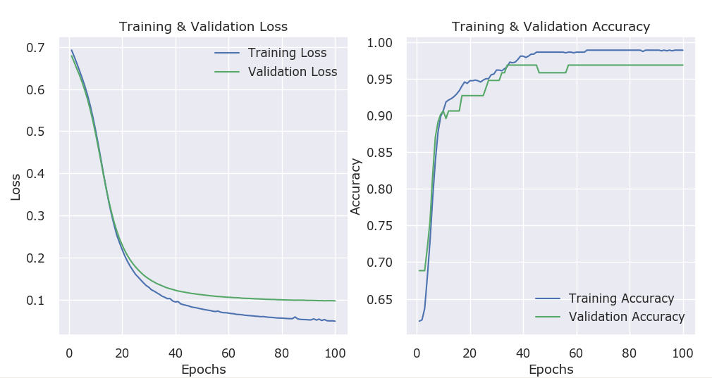
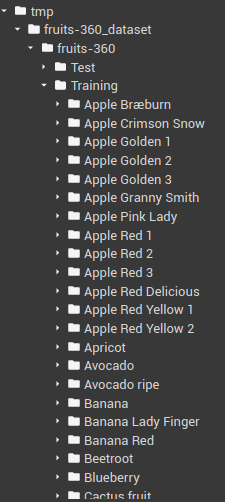

# Pytorch Toolkit - Tutorial

Thank you for your interest in the `Pytorch Toolkit`. I wrote this as a set of utility functions & classes that will
ease the process of training, evaluating & running predictions from a model. As a developer, I would rather spend my
time productively concentrating on the core tasks of ML - viz. preparing data, designing/re-using appropriate model
architecture and tuning the hyper-parameters to get the best performance from the model. Keras does a great job of
hiding boilerplate code for training the model, evaluating performance and running predictions. I aim to bring the ease
that Keras provides to Pytorch via the `Pytorch Toolkit`. Most of the API is similar to the Keras API, so Keras users
should find it very easy to understand.

I am **releasing this code as-is with no warranties of any kind under the MIT license**. Please feel free to use this in
your projects, should you find it useful. Should you use it, please give me a mention :).

I wrote this library much before I discovered `Pytorch Lightning`. If you are looking for a professional maintained
library that can help you train your model efficiently on multiple GPUs/TPUs, then Lightning is the way to go. Mine is a
very humble attempt to 'replicate' the Keras interface for training.

| **NOTE**                                                                                                                                                                                                                                                                      |
|:------------------------------------------------------------------------------------------------------------------------------------------------------------------------------------------------------------------------------------------------------------------------------|
| <font color='firebrick'>This tutorial is **work-in-progress** and is expected to change to some extend, especially if I enhance the `Pytorch Toolkit` with more functions. Do keep checking back for changes - I don't expect the API to change drastically henceforth</font> |

This tutorial will gradually expose you to the API provided by the **Pytorch Toolkit**, so it is best that you **follow
along from beginning to the end**. I use a very informal style of writing, which I hope you'll like. The API is inspired
by Keras, so if you have used Keras before you'll feel very much at home.

I am assuming that you have already installed the pre-requisites and have done the preliminary test as explained in
the [Readme](Readme.md) file - if not, please do so now.

| **A Point To Note**                                                                                                                                                                                                                                                                                                                                                                                     |
|:--------------------------------------------------------------------------------------------------------------------------------------------------------------------------------------------------------------------------------------------------------------------------------------------------------------------------------------------------------------------------------------------------------|
| <font color='firebrick'>This is **NOT an ML tutorial** - I don't _teach_ you how to create the best model, training techniques, data loading & preparation techniques etc. This tutorial is _strictly aimed_ at showing you how the `Pytorch Toolkit` can be used to write much lesser code during the phase of training & evaluating model...and nothing more! I cover various scenarios below.</font> |

With that perspective, let's get started.

## Dependencies

`Pytorch Toolkit` relies on the following Python libraries, which must be installed using `pip` or `conda`. It has been
tested on Python 3.8+ on Windows and Linux - I don't own a Mac :(.

* pathlib
* numpy
* pandas
* matplotlib & seaborn
* sklearn
* torch (Pytorch, of course!)
* torchsummary
* torchmetrics

## Training model when data available in 2D Numpy arrays

Often data & labels are available in Numpy arrays. This is true especially for structured datasets (e.g. datasets
available with the `scikit-learn` package, like the Iris dataset, the Boston Housing dataset, the Wisconsin Breast
Cancer dataset etc.) and in several repositories on Kaggle and UCI.

| **Tip**                                                                                                                                                   |
|:----------------------------------------------------------------------------------------------------------------------------------------------------------|
| <font color='green'>This scenario will most probably apply to cases when your data is available in a structured columnar format (e.g. a CSV file).</font> |

We'll start with one such example, specifically a _binary classification problem_ on the Wisconsin Breast Cancer
dataset. I'll be downloading the data from
the [UCI Repository link](https://archive.ics.uci.edu/ml/datasets/Breast+Cancer+Wisconsin+(Diagnostic)), but you can
load it from the `scikit-learn datasets` module as well.

For complete code listing see [Wisconsin Breast Cancer](pyt_breast_cancer.py) code file.

### Loading data

This section _does not strictly pertain to the Pytorch Toolkit API_, but I am showing the code nonetheless so you have
some perspective on how our model can be easily trained on data & labels available as Numpy Arrays. Here is the code I
used to load the Wisconsin Breast Cancer dataset - I am not providing detailed instructions here (as it does not pertain
to the Pytorch toolkit)

```python
import pandas as pd
from sklearn.model_selection import train_test_split
from sklearn.preprocessing import StandardScaler

# loading & preparing data
url = 'https://archive.ics.uci.edu/ml/machine-learning-databases/breast-cancer-wisconsin/wdbc.data'

cols = [
    "id","diagnosis","radius_mean","texture_mean","perimeter_mean","area_mean",
    "smoothness_mean","compactness_mean","concavity_mean","concave points_mean",
    "symmetry_mean","fractal_dimension_mean","radius_se","texture_se","perimeter_se",
    "area_se","smoothness_se","compactness_se","concavity_se","concave points_se",
    "symmetry_se","fractal_dimension_se","radius_worst","texture_worst","perimeter_worst",
    "area_worst","smoothness_worst","compactness_worst","concavity_worst",
    "concave points_worst","symmetry_worst","fractal_dimension_worst"
]

df = pd.read_csv(url, header=None, names=cols, index_col=0)
# map 'M' (malignant) to 1 and 'B' (benign) to 0
df['diagnosis'] = df['diagnosis'].map({'M':1, 'B':0})

# grab the data & labels - these will be Numpy arrays!
X = df.drop(['diagnosis'], axis=1).values
y = df['diagnosis'].values

# split into train/test sets
X_train, X_test, y_train, y_test = \
    train_test_split(X, y, test_size=0.20, random_state=41)

# scale data using Standard scaling
ss = StandardScaler()
X_train = ss.fit_transform(X_train)
X_test = ss.transform(X_test)
```

### Creating our model

You would normally create your Pytorch model by deriving your model from the `torch.nn.Module` base class, somewhat as
follows:

```python
import torch
import torch.nn as nn
import torch.nn.functional as F

class WBCNet(nn.Module):
    def __init__(self, inp_size, hidden1, hidden2, num_classes):
        super(WBCNet, self).__init__()
        self.fc1 = nn.Linear(inp_size, hidden1)
        self.fc2 = nn.Linear(hidden1, hidden2)
        self.out = nn.Linear(hidden2, num_classes)

    def forward(self, inp):
        x = F.relu(self.fc1(inp))
        x = F.relu(self.fc2(x))
        x = F.sigmoid(self.out(x))
        return x

# instantiate the model
model = WBCNet(32, 32, 10)
```

With the `Pytorch Toolkit` the **only change** you make is to the base class from which you derive the module. I provide
a class called `PytkModule`, which _derives_ from `nn.Module`. This class provides additional functions to help with
model training, evaluation and testing. Of course, you will also have to `import pytorch_toolkit` to make this happen. *
*I assume you have saved the `pytorch_toolkit.py` file to some folder in `sys.path` or in the _current_ folder**

Here is how you'll define your Module when using the Pytorch Toolkit:

```python
import torch
import torch.nn as nn
import torch.nn.functional as F

# Change #1 -> import the Pytorch toolkit
import pytorch_toolkit as pytk

# Change #2 -> change the base class from nn.Module to pytk.PytkModule
class WBCNet(pytk.PytkModule):
    def __init__(self, inp_size, hidden1, hidden2, num_classes):
        super(WBCNet, self).__init__()
        self.fc1 = nn.Linear(inp_size, hidden1)
        self.fc2 = nn.Linear(hidden1, hidden2)
        self.out = nn.Linear(hidden2, num_classes)

    def forward(self, inp):
        x = F.relu(self.fc1(inp))
        x = F.relu(self.fc2(x))
        x = F.sigmoid(self.out(x))
        return x

# instantiate the model
model = WBCNet(32, 32, 10)
```

Notice that **the only change you made was the base class from which your model is derived!**. You
constructor `__init__(...)` and the `forward(...)` method _are exactly the same as before_!

Before you can start training the module, you'll need to specify the `loss` function, the `optimizer` and `metrics` to
track during the training epochs (Yes! The `Pytorch Toolkit` provides several common metrics that you can use out-of the
box - like `Accuracy`, `F1-Score`, `MSE`, `MAE` etc., which you can use).

| **NOTE**                                                                                                                                                                                                                                                                  |
|:--------------------------------------------------------------------------------------------------------------------------------------------------------------------------------------------------------------------------------------------------------------------------|
| **At this time there is no support to add your own metrics** - something that I plan on adding at a future date. However, I do include the most common metrics that I normally use during training. So, hopefully, this omission does not prove to be a major impediment. |

```python
# instantiate the loss function & optimizer (nothing PyTk specific here)
loss_fn = nn.BCELoss()
optimizer = torch.optim.SGD(
    model.parameters(), lr = 0.001,
    nesterov = True, weight_decay = 0.005, momentum = 0.9, dampening = 0
) 
```

and this is how you _attach_ these to your model using it's `compile()` method:

```python
# NOTE: model is an instance of PytkModule class
# it provides a compile() method, which allows me to specify the loss function, the optimizer and metrics to track when training
model.compile(loss=loss_fn, optimizer=optimizer, metrics=['acc'])
```

* Notice that the above line is very Keras-like (I've done this on purpose). Keras does a lot more with
  it's `compile(...)` method. I merely set attributes of the `PytkModule` derived class!
* You can _optionally specify_ one or more metrics that the training loop should track using the `metrics` parameter of
  the `compile()` method. Metrics are specified using their associated string aliases (just like in Keras) - refer to
  the table below for supported metrics.
* You _need not specify any metrics_ (for example by omitting the optional`metrics` parameter in above call).

| **NOTE**                                                                                                                                                                                                                                                                                                                                                                                                        |
|:----------------------------------------------------------------------------------------------------------------------------------------------------------------------------------------------------------------------------------------------------------------------------------------------------------------------------------------------------------------------------------------------------------------|
| <ol><li>The training loop will **always track** the `loss` metric, _even if you leave out the metrics parameter in the `compile()` call_.</li><li>The `loss` metric is tracked _in addition to any other metrics you supply_ in the metrics parameter of the `compile()` call.</li><li>Additionally, you don't have to specifically mention the `loss` metric explicitly in your `metrics` parameter.</li></ol> |

**Table of available metrics**

| String Alias              | Metric                                                    | 
|:--------------------------|:----------------------------------------------------------|
| `'acc'` or `'accuracy'`   | Accuracy (works for binary and multiclass classification) |
| `'prec'` or `'precision'` | Precision                                                 |
| `'rec'` or `'recall'`     | Recall                                                    |
| `'f1'` or `'f1_score'`    | F1 Score                                                  |
| `'roc_auc'`               | ROC AUC Score                                             |
| `'mse'`                   | Mean Square Error (for regression)                        |
| `'rmse'`                  | Root Mean Square Error (for regression)                   |
| `'mae'`                   | Mean Absolute Error (for regression)                      |
| `'r2_score'`              | R2 Score (for regression)                                 |

### Training our model

Here is where the Pytorch Tooklit shines - **you don't have to write the code that loops through epochs, generates
batches of data etc. etc.** - just call the model's `fit(...)` method as shown below:

```python
hist = model.fit(X_train = X_train, y_train = y_train, epochs = 100, batch_size = 16)
```

The `fit(...)` method takes many more parameters, which I will cover as we progress through this tutorial.

* At the minumum, you need to provide values for the `X_train` (data) and `y_train` (labels)
  parameters [both Numpy arrays].
* The `epochs` and `batch_size` parameters have default values (`epochs=25` and `batch_size=64` respectively) - in this
  example, I have chosen different values for these parameters.

You should see output like the one shown below (output has been truncated for brevity).

```
Epoch (  1/100): (455/455) -> loss: 0.6900 - acc: 0.6296
Epoch (  2/100): (455/455) -> loss: 0.6696 - acc: 0.6373
...
... many more lines (truncated)
...
Epoch ( 99/100): (455/455) -> loss: 0.0512 - acc: 0.9871
Epoch (100/100): (455/455) -> loss: 0.0506 - acc: 0.9871
```

The output should be fairly easy to comprehend, especially if you have used Keras before. Each line shows the epoch wise
progress of training loop - this is followed by by record count and then the metrics you specified (here `loss`
and `acc`) - `loss` will be tracked even if you don't specify any metrics.

### Cross-training with validation data

It is always a good practice to cross-train your model using a `training` dataset and an `evaluation` dataset. You can
easily accomplish this with the Pytorch Toolkit as shown below. Just modify the `fit(...)` call as follows:

```python
hist = model.fit(
    X_train, y_train, epochs = 100, batch_size = 16,
    validation_split = 0.20
)
```

The `validation_split` parameter takes a value between `0.0` and `1.0`. The `X_train` & `y_train` training data &
labels (Numpy arrays) are internally _randomly_ split into `training` and `cross-validation` datasets using
the `validation_split` _proportion_ specified. For example, in the above call, the `X_train` & `y_train` get _randomly_
split in a 80%:20% proportion, with 20% getting assigned as the cross-validation dataset. Output from the training loop
will be slightly different, as shown below:

```
Epoch (  1/100): (364/364) -> loss: 0.6926 - acc: 0.6196 - val_loss: 0.6790 - val_acc: 0.6884
Epoch (  2/100): (364/364) -> loss: 0.6771 - acc: 0.6214 - val_loss: 0.6638 - val_acc: 0.6884
...
... many more (truncated)
...
Epoch ( 99/100): (364/364) -> loss: 0.0496 - acc: 0.9891 - val_loss: 0.0974 - val_acc: 0.9688
Epoch (100/100): (364/364) -> loss: 0.0489 - acc: 0.9891 - val_loss: 0.0971 - val_acc: 0.9688
```

Notice that metrics are now being tracked for the `training` dataset _as well as_ the `cross-validation` dataset (
metrics for the cross-validation datasets are marked with `val_`, e.g. `val_loss` is loss for the validation dataset)

### Using a _dedicated_ validation dataset

Sometimes a separate validation dataset is available (e.g. in separate Numpy arrays - let's say we call these `X_val`
and `y_val` for the data and labels respectively). To use these, make the following change to the `fit(...)` call, as
shown below:

```python
hist = model.fit(
    X_train, y_train, epochs = 100, batch_size = 16,
    validation_data = (X_val, y_val)
)
```

We have asked the model to to use `X_val` and `y_val` as the cross-validation data & labels by passing them as a tuple
via the `validation_data` parameter. We don't use `validation_split` parameter in this case.

| **NOTE**                                                                                                                                                                                                                                                                                                                  |
|:--------------------------------------------------------------------------------------------------------------------------------------------------------------------------------------------------------------------------------------------------------------------------------------------------------------------------|
| <ul><li>Avoid using both the `validation_split` and `validation_data` parameters together.</li><li>If you specify both the `validation_split` and `validation_data` parameters in the `fit()` call, then the `validation_dataset` parameter will take precedence and `validation_split` will simply be ignored.</li></ul> |

### Tracking Multiple Metrics

Suppose you want to track `accuracy` and `F1-Score` by epoch. Here is what you do:

* Specify the metrics you want to track in your `model.compile(...)` call as follows (for metric aliases please refer to
  table above):

```python
model.compile(
    loss = loss_fn, optimizer = optimizer,
    metrics = ['acc', 'f1']
)
```

* Call `fit(...)` as usual - no changes here!

```python
hist = model.fit(
    X_train, y_train, epochs = 100, batch_size = 16,
    validation_split = 0.20
)
```

You should see output like the following - notice the extra metric being tracked for the `training`
and `cross-validation` datasets.

```
Epoch (  1/100): (364/364) -> loss: 0.6926 - acc: 0.6196 - f1: 0.0488 - val_loss: 0.6790 - val_acc: 0.6884 - val_f1: 0.0000
Epoch (  2/100): (364/364) -> loss: 0.6771 - acc: 0.6214 - f1: 0.0696 - val_loss: 0.6638 - val_acc: 0.6884 - val_f1: 0.0000
...
... many more
...
Epoch ( 99/100): (364/364) -> loss: 0.0496 - acc: 0.9891 - f1: 0.9868 - val_loss: 0.0974 - val_acc: 0.9688 - val_f1: 0.9681
Epoch (100/100): (364/364) -> loss: 0.0489 - acc: 0.9891 - f1: 0.9844 - val_loss: 0.0971 - val_acc: 0.9688 - val_f1: 0.9681
```

### Viewing model's performance across epochs

The `Pytorch Toolkit` provides a `show_plots(...)` function which plots the `loss` and (optionally) any one metric of
your choice from the list of metrics you specified in the `compile()` call. These plots will quickly help you ascertain
if your model is overfitting or underfitting the data it is trained on.

The `fit(...)` call returns a `history` object, which is basically a map of all the metrics tracked across the various
epochs (e.g. `hist['loss']` is a `list` of `loss`(es) per epoch. So if you specified `epochs=100` in your `fit(...)`
call, this would point to a list of 100 values for `loss` and so on).

Similarly, if you specified `metrics=['acc','f1']`, then the `hist` object will also have 100 values each for the `acc`
and `f1` metrics. In addition, if you also specified `validation_split` or `validation_data`, then it will also track
validation metrics - 100 values each for `val_loss`, `val_acc` and `val_f1`.

**After training is completed**, call `show_plots()` as follows (note that this is a standalone function and not a
method of any class)

```python
pytk.show_plots(
    hist, metric = 'acc',
    plot_title = 'Optional title of your plot'
)
```

* `hist` is the value returned by the `fit(...)` call as shown above.
* `metric` (optional, default=None) is the additional metric you want to plot. **This should be a string value and
  should be one of the metrics you track in the `metrics=[...]` parameter** of the `compile()` call. You can leave it
  out, in which case only the `loss` will be plotted. Recall that `loss` is tracked by default! You should specify the
  metric using the same string value you used in the `compile()` call - e.g. if you used metric=['accuracy'], then you
  should use `metric='accuracy'` here. **In this version, there is support for just 1 metric (apart from `loss`)**.
* `plot_title` is a user defined title for your plot (e.g. 'Performance plots of model
  XXX') [Optional: with a default value of None (no title)]
* `fig_size=(x, y)` - this is an additional optional parameter you can specify to size your plot to some dimension of
  your choice - I use it only if my plot gets 'crunched up'. The default value is `fig_size=(16,5)`

The output of the above `show_plots(...)` call will be something like below - on the left is the plot of loss vs
epochs (for both the training & cross-validation datasets) and on the right is the plot for `acc` against epochs.



You can see that across epochs, the _training_ and _validation_ losses fall to their lows, whereas the accuracies rise
to their highest values. If there is a large gap between the loss plots, with `training loss << validation loss` your
model is over-fitting training data! The epochs from where these plots start to diverge is the point from where the
model has started over-fitting. Similarly, if the `validation loss is << than training loss`, your model is
under-fitting.

### Evaluating Model performance

Once you are done with training, you will want to verify model's performance on `testing` data & labels. You should
never _expose_ your model to test data during training! This can be done as follows:

```python
# assuming you are tracking both accuracy & f1-score metrics
loss, acc, f1 = model.evaluate(X_test, y_test)
print(f'  Test dataset  -> loss: {loss:.4f} - acc: {acc:.4f} - f1: {f1:.4f}')
```

You'll see something like the following:

```
Evaluating (114/114) -> loss: 0.0622 - acc: 0.9922 - f1: 0.9906
  Test dataset  -> loss: 0.0622 - acc: 0.9922 - f1: 0.9906
```

| NOTE                                                                                                                                                                                                                                                                                                                  |
|:----------------------------------------------------------------------------------------------------------------------------------------------------------------------------------------------------------------------------------------------------------------------------------------------------------------------|
| The `evaluate(...)` call returns _as many values_ as the metrics you are tracking during training. Recall that the `fit(...)` call **always** tracks `loss` even if you don't explicitly specify it in the metrics list! of the `compile(...)` call. We also specified `acc` and `f1`, hence we'll get back 3 values. |

You can always evaluate model's performance on any dataset - for example, to evaluate performance on the training set,
use the following code:

```python
# assuming you are tracking both accuracy & f1-score metrics
loss, acc, f1 = model.evaluate(X_train, y_train)
print(f'  Train dataset  -> loss: {loss:.4f} - acc: {acc:.4f} - f1: {f1:.4f}')
```

You should see output similar to the one shown above.

### Saving the model's state:

Once you are happy with the model's performance, you may want to save the model's weights and structure to disk, so you
can just load this at a later date and use the model without having to re-train it. The `PytkModule` provides a `save()`
method to do just that. Use it on an instance of the model as follows:

```python
# specify path of file where model state should be saved
model.save('./model_states/wbc.pt')
```

* `save()` takes a path to file where the model state is saved - if the directory leading up to the path does not exist,
  it is created the very first time `save()` is called.
* `save()` method saves the model's `state_dict` under the hood, by calling `torch.save(model.state_dict()...)`

### Loading model's state from disk

The `PytkModule` class provides a  `load()` method to load the model's state from disk. It will load the model's
saved `state_dict` from disk. Here is how you use the `load()` method.

```python
# first instantiate the model using API provided in the class definition 
model = WBCNet(32, 32, 10)
model.load('./model_states/wbc.pt')
```

**NOTE:**

* The `load()` call takes the complete path of the file name to which the model was saved. If this path does not exist
  and `IOError` exception is thrown.
* The `load()` method will load just object's `state_dict` from disk. You still have to assign the `loss` function,
  the `optimizer` and the `metrics` should you want to retrain the model.

**Best Practice**

* I usually encapsulate the model creatioon function in a separate function, which I call `build_model()`, but you can
  choose any name
* In this function, I instantiate the model as well as call the `compile()` method to assign the `loss`, `optimizer` and
  the `metrics`
* I return the model instance & optimizer instance from this call - the latter is required if you want to assign a
  learning rate scheduled (covered later)

For example, I would create a `build_model()` function for this example as below:

```python
def build_model():
    model = WBCNet(32, 32, 10)

    loss_fn = nn.BCELoss()
    optimizer = torch.optim.SGD(model.parameters(), lr=0.001,...)
    model.compile(loss=loss_fn, optimizer=optimizer, metrics=['acc'])
    return model, optimizer
```

And before the `load()` call, I would then do something like:

```python
model = build_model()
model.load('./model_states/wbc.pt')
```

### Running Predictions

Once you have trained the model and are satisfied with the performace, you will run predictions on the _test_ data and
labels (or even on the _training_ data and labels). The `PytkModule` class provided a  `predict(...)` method, which can
be used as follows:

```python
y_pred = model.predict(X_test)
```

**NOTE:**

* The call above returns a Numpy array of _class probabilities_
* For a _binary classification_ problem, such as this one, `y_pred` is a Numpy array of shape `(X_test.shape[0], 1)` (
  i.e. has as many rows as `X_test` but just 1 column)
* For a _multi-class classification_ problem, with `N` possible output classes, `y_pred` will be a Numpy array of
  shape `(X_test.shape[0], N)`

So for a _binary classification_ problem, I would normally use the following code to predict outcomes, since I am
interested in binary values (0, 1) instead of probabilities.

```python
y_pred = np.round(model.predict(X_test)).reshape(-1)
```

This call will return a 1 dimensional Numpy array, with each element rounded to either 0 or 1, instead of
an `[X_test.shape[1], 1]` shaped Numpy array

This completes our first example - please refer to the code
for [Wisconsin Breast Cancer Classification](pyt_breast_cancer.py) example for the complete code.

### Multiclass Classifiction with data & labels in Numpy Arrays

There is **absolutely no change** in the way you would train, evaluate and test a model's performance for multi-class
classification. You may need to change the way you prepare data, and most probably create a model with a different
architecture (no of layers, types of layers etc.). I have included multi-class classification problems on Numpy arrays
in the Github repository:

* Refer to the [Iris Flower Classification](pyt_iris.py) example, which classifies 4 flower species depending on various
  sepal & petal attributes.
* Also see the [Wine Classification](pyt_wine.py) Python file for another example.

NOTE:
For generating class predictions, you would use a call as follows:

```python
y_pred = np.argmax(model.predict(X_test), axis = 1)
```

* For M rows in the test dataset, this will return a 1 dimensional Numpy array with M elements, with each element taking
  a value between 0 & N-1, where N is the number of classes.
* Without this call you will get a Numpy array of shape (M, N), with each row consisting of N values of probabilities of
  each class.

## Training with Pytorch Datasets & Transforms

Pytorch provides powerful `dataset` and `transforms` classes in its `torchvision` package. These are indespensible,
especially for image classification problems. The
`Pytorch Toolkit` provides equivalent functions `fit_dataset(...)`, `evaluate_dataset(...)` and `predict_module(...)`
that allow you to seamlessly work with `torchvision` datasets. As before, let's walk through an example - this is the
MNIST digits classification example, for which we can use either an Multilayer Perceptron (MLP) or a Convolutional
Neural Network (CNN).

For the complete code used in this section, refer to the [MNIST Classification](pyt_mnist_dnn.py) example, where both a
MLP and a CNN is used.

### Loading data

Again, this section _does not strictly pertain to the Pytorch Toolkit API_, but I am showing the code nonetheless so you
have some perspective on how the data is loaded using `torchvision.datasets` and `torchvision.transforms`

```python
from torchvision import datasets, transforms

# transform data to Pytorch Tensors
transformations = transforms.Compose([transforms.ToTensor(),])

# download the training & test datasets, if required, and apply transforms
train_dataset = datasets.MNIST(root='./data', train=True, download=True, 
                               transform=transformations) 
print("No of training records: %d" % len(train_dataset))

test_dataset = datasets.MNIST('./data', train=False, download=True, 
                              transform=transformations)
print("No of test records: %d" % len(test_dataset))

# Randomly split the 10,000 records in the training datsset in ratio of 8000:2000 records, 
# which we assign to the training & cross-validation datasets respectively
val_dataset, test_dataset = torch.utils.data.random_split(test_dataset, [8000, 2000])
print("No of cross-val records: %d" % len(val_dataset))
print("No of test records: %d" % len(test_dataset))
```

### Building our model

This is straight forward - as before we derive our model from `pytk.PytkModule`.

```python
import pytorch_tooklit as pytk

# some globals - MNIST digits dataset as 28x28 black & white images
IMAGE_HEIGHT, IMAGE_WIDTH, NUM_CLASSES = 28, 28, 1
# we are classifying 10 classes corresponding to 10 digits 0-9
NUM_CLASSES = 10

# a multi-layer Perceptron (MLP) network
class MNISTNet(pyt.PytModule):
    def __init__(self):
        super(MNISTNet, self).__init__()
        self.fc1 = pytk.Linear(IMAGE_HEIGHT * IMAGE_WIDTH * NUM_CHANNELS, 128)
        self.fc2 = pytk.Linear(128, 64)
        self.out = pytk.Linear(64, NUM_CLASSES)

    def forward(self, x):
        # flatten input (for DNN)
        x = pyt.Flatten(x)
        x = F.relu(self.fc1(x))
        x = F.relu(self.fc2(x))
        # NOTE: nn.CrossEntropyLoss() includes a logsoftmax call, which 
        # applies a softmax function to outputs. So, don't apply one yourself!
        # x = F.softmax(self.out(x), dim=1)  # -- don't do this!
        x = self.out(x)
        return x

# instantiate the model
model = MNISTNet()
```

The astute observer will notice that I have used `pytk.Linear()` instead of `nn.Linear()`. This is a function
implemented in `pytorch_toolkit.py` as follows:

```python
def Linear(in_nodes, out_nodes, bias=True):
    layer = nn.Linear(in_nodes, out_nodes, bias)
    # initialize weights with xavier_uniform and bias layer to all-zeros
    torch.nn.init.xavier_uniform_(layer.weight)
    if bias: torch.nn.init.zeros_(layer.bias)
    return layer
```

So all it's doing is adding _initializing code_ to the weights & bias of the layer - weights are initialized
using `xavier_uniform()` (same as `glorot_uniform()` from Keras) and the bias layer (if used) is initialized to
all-zeros. You can use `nn.Linear()` instead of `pyt.Linear()` if you prefer the initialization that Pytorch uses by
default.

If you prefer to use `Conv2d` layers instead, your module could be defined somewhat like the following:

```python
class MNISTConvNet(pytk.PytkModule):
    def __init__(self):
        super(MNISTConvNet, self).__init__()
        self.conv1 = pytk.Conv2d(1, 32, kernel_size=5)
        self.conv2 = pytk.Conv2d(32, 32, kernel_size=5)
        self.conv3 = pytk.Conv2d(32, 64, kernel_size=5)
        self.fc1 = pytk.Linear(1*1*64, 256)
        self.out = pytk.Linear(256, NUM_CLASSES)
        self.dropout = nn.Dropout(0.10)

    def forward(self, x):
        x = F.max_pool2d(F.relu(self.conv1(x)), 2)
        x = F.dropout(x, p=0.5, training=self.training)
        x = F.max_pool2d(F.relu(self.conv2(x)), 2)
        x = F.dropout(x, p=0.5, training=self.training)
        x = F.max_pool2d(F.relu(self.conv3(x)),2)
        x = F.dropout(x, p=0.5, training=self.training)
        # flatten input (for DNN)
        x = pytk.Flatten(x)
        x = F.relu(self.fc1(x))
        x = F.dropout(x, training=self.training)
        # NOTE: nn.CrossEntropyLoss() includes a logsoftmax call, which applies a softmax
        # function to outputs. So, don't apply one yourself!
        # x = F.softmax(self.out(x), dim=1)  # -- don't do this!
        x = self.out(x)
        return x

# instantiate the model
model = MNISTConvNet()
```

Again, you'll notice that I have used `pytk.Conv2d()` instead of `nn.Conv2d()`. Just like in the previous case, this
implements the added step of initializing a `nn.Conv2d()` layer's weights with `xavier_uniform()` (or `glorot_uniform()`
for Keras users) and the layer's bias to all-zeros.

I also include a utility function `pytk.Flatten()`, which flattens the previous Conv2d (a 3D layer) into a 2D layer,
which can then be fed into a `nn.Linear` layer. `pytk.Flatten()` is implemented as below:

```python
def Flatten(x):
    return x.view(x.shape[0],-1)
```

As before, we need to call the `compile()` method of the model, passing in a loss function, an optimizer and metrics we
want to track. Here is the code for the same:

```python
loss_fn = nn.CrossEntropyLoss()
optimizer = optim.Adam(params = model.parameters(), lr = 0.01, weight_decay = 0.0005)
model.compile(loss = loss_fn, optimizer = optimizer, metrics = ['acc'])
```

### Training model using datasets

Since we are using Pytorch datasets API, training, evaluating and testing the model will use different functions of the
model class.

To train the model, call the `fit_dataset(...)` method as follows:

```python
hist = model.fit_dataset(
    train_dataset,
    validation_dataset = val_dataset,
    epochs = NUM_EPOCHS, batch_size = BATCH_SIZE
)
```

This is almost similar to the `fit()` call - instead of passing `X_train/y_train` Numpy arrays, we pass
datasets `train_dataset` and `val_dataset`. Output is similar to the one you saw with the `fit()` call. As with
the `fit(...)` call, `val_dataset` is an optional parameter.

```
Training on 60000 samples, cross-validating on 8000 samples
Epoch ( 1/25): (60000/60000) -> loss: 0.2446 - acc: 0.9285 - val_loss: 0.1272 - val_acc: 0.9617
Epoch ( 2/25): (60000/60000) -> loss: 0.1128 - acc: 0.9660 - val_loss: 0.0955 - val_acc: 0.9701
...
... many more records
...
Epoch (24/25): (60000/60000) -> loss: 0.0159 - acc: 0.9984 - val_loss: 0.0507 - val_acc: 0.9839
Epoch (25/25): (60000/60000) -> loss: 0.0159 - acc: 0.9984 - val_loss: 0.0509 - val_acc: 0.9845
```

| NOTE                                                                                                                                                                                                                                                                                                                                                                   |
|:-----------------------------------------------------------------------------------------------------------------------------------------------------------------------------------------------------------------------------------------------------------------------------------------------------------------------------------------------------------------------|
| The `validation_dataset` parameter is optional - omit it if you do not want to use a validation dataset. However, it is a good practice to cross-train model<br/> As with the `fit(...)` call, you can use `validation_split=split_proportion` instead of `validation_dataset` - this will randomly split the train dataset into a training & cross-validation dataset |

### Evaluating model's performance on test dataset

To get an unbiased view of the model's performance, we should evaluate it against `test dataset` that the model has not
_seen_ during the entire training process. Notice that we have not used `test_dataset` so far. To evaluate model
performance using Pytorch datasets, use the following call:

```python
loss, acc = model.evaluate_dataset(test_dataset)
print(f'  Test dataset -> loss: {loss:.4f} - acc: {acc.4f}')
```

As before, the `evaluate_dataset()` will return _as may values as the number of metrics_ you specify in the `compile()`
call. **The `loss` metric will always be tracked even if you do not specify it in the metrics list**. Output of the
above call is something like shown below:

```
Evaluating (2000/2000) -> loss: 0.0642 - acc: 0.9790
  Test dataset -> loss: 0.0642 - acc: 0.9790
```

### Making Predictions

To make predictions after training our model using a Pytorch `dataset`, call the `model.predict_module(...)` method as
shown below:

```python
y_pred, y_true = model.predict_module(test_dataset)
# convert prediction probabilities to classes
y_pred = np.argmax(y_pred, axis = 1)
print('We got %d/%d incorrect!' % ((y_pred != y_true).sum(), len(y_true)))
```

Notice that this function returns 2 values (**both Numpy arrays**) - the prediction probabilities (`y_pred`) and the
actual values (`y_true`) - classes. `y_pred.shape = (X_train.shape[0], NUM_CLASSES)`, hence the
following `np.argmax(...)` call to reduce the dimension to 1 along the columns. `y_pred` will have shape
of `(X_train.shape[0],)` so the `np.argmax(...)` call is not required for `y_true`.

Output from the above function is something like below:

```
Sample labels (50):  [7 8 3 6 9 4 5 7 2 2 3 5 0 0 3 3 0 8 2 9 8 2 4 8 8 5 1 3 6 3 1 2 3 7 4 7 3 8 7 7 9 9 3 9 0 7 7 1 4 0]
Sample predictions:  [7 8 3 6 9 4 5 7 2 2 3 5 0 0 3 3 0 8 2 9 8 2 4 8 8 5 1 3 6 3 1 2 3 7 4 7 3 8 7 7 9 9 3 9 0 7 7 1 4 0]
We got 43/2000 incorrect!
```

### Using Learning Rate Schedulers during training

Often it is useful to step the learning as epochs increase to prevent the model from overshooting the global minima as
it tries to descend towards it. There are several learning rate schedulers that the Pytorch library supplies - we can
use anyone of them.

I normally use the `StepLR` learning rate scheduler, which I instantiate as follows:

```python
# instantiate your preferred learning rate scheduler
# reduce LR every 10th epoch by 0.2 times
scheduler = torch.optim.lr_scheduler.StepLR(optimizer, step_size=10, gamma=0.2)
```

where, `optimizer` points to the optimizer we use with our model.

To use the scheduler when training, we supply it via the `lr_scheduler` parameter of the `fit()` or the `fit_dataset()`
methods of our `PytkModule`.

For example, to use this with the Wisconsin Breast Cancer example, I would use the following `fit()` call

```python
# for the Wisconsin Breast Cancer example
hist = model.fit(
    X_train, y_train, epochs = 100, batch_size = 16,
    validation_split = 0.20, lr_scheduler = scheduler
)
```

and with the MNIST example, where we use datasets, the call would be as follows:

```python
# for the Wisconsin Breast Cancer example
hist = model.fit_dataset(
    train_dataset, validation_dataset = val_dataset,
    epochs = NUM_EPOCHS, batch_size = BATCH_SIZE,
    lr_scheduler = scheduler
)
```

For the complete code used in this section, refer to the [MNIST Classification](pyt_mnist_dnn.py) example, where you can
train/evaluate/test both MLP and CNN architectures.

## Using `nn.Sequential` API

Personally I find using the traditional method, i.e. deriving your class from nn.Module, a bit tedious. I'll admit that
I have spent hours debugging issues with my `forward()` method - I simply could never get it right the first time.
The `nn.Sequential` API provided by Pytorch was a life-saver for me. It helps me clearly _visualize_ the sequence of
operations in my module and what's more - I don't have to write a `forward()` method - how convenient!

In this section I'll cover how we can use the `Pytorch Toolkit` with models created with the `nn.Sequential` API. I'll
illustrate this with a multiclass classification problem, specifically classification of 10 image classes of
the `CIFAR10` imagesets. You can get more information about the CIFAR10
datasets [here](https://www.cs.toronto.edu/~kriz/cifar.html)

### Loading Data

As before, this section _does not strictly apply to the `Pytorch Toolkit`_. For loading the `CIFAR10` images data, I use
the following code - data (images & labels) is returned as torchvision datasets.

```python
def load_data():
    """
    Load the data using datasets API. 
    We apply some random transforms to training datset as we load the data
    We also split the test_dataset into cross-val/test datasets using 80:20 ratio
    """
    IMGNET_MEAN, IMGNET_STD = 0.5, 0.3  # approximate values

    xforms = {
        'train' : [
            # add transforms here - scaling, shearing, flipping etc.
            transforms.RandomCrop(32, padding=4),
            transforms.RandomHorizontalFlip(),   
            transforms.ToTensor(),
            transforms.Normalize((IMGNET_MEAN, IMGNET_MEAN, IMGNET_MEAN),
                                 (IMGNET_STD, IMGNET_STD, IMGNET_STD))
        ],
        'test' : [
            transforms.ToTensor(),
            transforms.Normalize((IMGNET_MEAN, IMGNET_MEAN, IMGNET_MEAN),
                                 (IMGNET_STD, IMGNET_STD, IMGNET_STD))
        ],
    }

    train_dataset = datasets.CIFAR10(root='./data', train=True, download=True,
                                     transform=transforms.Compose(xforms['train']))
    print("No of training records: %d" % len(train_dataset))

    test_dataset = datasets.CIFAR10('./data', download=True, train=False,
                                    transform=transforms.Compose(xforms['test']))
    print("No of test records: %d" % len(test_dataset))

    # randomly split the 10,000 records in the test dataset into cross-validation &
    # test datasets in a 80:20 ratio
    val_dataset, test_dataset = torch.utils.data.random_split(test_dataset, [8000, 2000])
    print("No of cross-val records: %d" % len(val_dataset))
    print("No of test records: %d" % len(test_dataset))

    return train_dataset, val_dataset, test_dataset


# load the data
train_dataset, val_dataset, test_dataset = load_data()
```

### Building the model

Building the model is a two step process:

* Build the model using the `nn.Sequential` API as usual
* Wrap the model using the `PytkModelWrapper` class provided by the `Pytorch Toolkit`

These steps are shown below:

```python
class Flatten(nn.Module):
    def forward(self, input):
        return input.view(input.size(0), -1)

def build_model(l1, l2, l3):
    # NOTE: l2, l2 & l3 are nodes for the 3 Conv2d layers 
    model = nn.Sequential(
        pytk.Conv2d(3, l1, 5, padding=1),
        nn.ReLU(),
        nn.BatchNorm2d(l1),
        pytk.Conv2d(l1, l1, 5, padding=1),
        nn.ReLU(),
        nn.BatchNorm2d(l1),
        nn.MaxPool2d(kernel_size=2, stride=2),
        nn.Dropout(0.10),

        pytk.Conv2d(l1, l2, 5, padding=1),
        nn.ReLU(),
        nn.BatchNorm2d(l2),
        pytk.Conv2d(l2, l2, 5, padding=1),
        nn.ReLU(),
        nn.BatchNorm2d(l2),
        nn.MaxPool2d(kernel_size=2, stride=2),
        nn.Dropout(0.10),

        pytk.Conv2d(l2, l3, 3, padding=1),
        nn.ReLU(),
        nn.BatchNorm2d(l3),
        pytk.Conv2d(l3, l3, 3, padding=1),
        nn.ReLU(),
        nn.BatchNorm2d(l3),
        nn.MaxPool2d(kernel_size=2, stride=2),
        nn.Dropout(0.10),

        Flatten(),

        nn.Linear(2*2*l3, 512),
        nn.Dropout(0.20),        

        nn.Linear(512, 256),
        nn.Dropout(0.25),        

        nn.Linear(256, 10)
    )
    return model

# wrap our model using the PytkModuleWrapper class
model = pytk.PytkModuleWrapper(build_model(32, 64, 128))
```

The `PytkModuleWrapper` class provides the same functions that the `PytkModule` class provided -
viz. `fit()`, `fit_dataset()`, `evaluate()`, `evaluate_dataset()` etc. It wraps around a module created with
the `nn.Sequential` API, hence the name.

Once the module is created, you will assign it a loss function, an optimizer and (optionally) metrics to be tracked
during the training loop - this is done the same was as shown with `PytkModule` class. Here is the code:

```python
LEARNING_RATE, L2_REG = 0.001, 0.0005
loss_fn = nn.CrossEntropyLoss()
optimizer = optim.Adam(params = model.parameters(), lr = LEARNING_RATE, weight_decay = L2_REG)
model.compile(loss = loss_fn, optimizer = optimizer, metrics = ['acc'])
```

In this example we are using the `Adam` optimizer and the `CrossEntropyLoss` loss function (as this is a multiclass
classification problem). We choose to track the accuracy metric, with the `metrics=['acc']` parameter.

### Training the model

This is exactly the same as with the `PytkModule` derived class - just call the `fit_dataset()` (since we loaded data
into datasets) on the instance of the model. Alternately, had you used Numpy arrays for data and labels, you would
call `fit()` on the model instance.

```python
hist = model.fit_dataset(
    train_dataset, validation_dataset = val_dataset,
    epochs = NUM_EPOCHS, batch_size = BATCH_SIZE
)
```

Alternatively, had you sourced data & labels as Numpy arrays instead of torchvision datasets, you would use the
following call:

```python
# either using validation_split
hist = model.fit(
    X_train, y_train, validation_split = 0.2,
    epochs = NUM_EPOCHS, batch_size = BATCH_SIZE
)

# or using validation_data
hist = model.fit(
    X_train, y_train, validation_data = (X_val, y_val),
    epochs = NUM_EPOCHS, batch_size = BATCH_SIZE
)
```

All the above calls return the same kind of `history` object as before, so you can plot your model's `loss` and `acc`
curves as before:

```python
pytk.show_plots(hist, metric = 'acc', plot_title = 'Model performance metrics')
```

### Evaluating model's performance

This is done exactly as before, using `evaluate_dataset()` or `evaluate()` on an instance of the model, depending on
whether data is fed from Pytorch datasets of Numpy arrays respectively.

```python
loss, acc = model.evaluate_dataset(test_dataset)
print('  Test dataset -> loss: %.4f - acc: %.4f' % (loss, acc))
```

Or had you sourced data as Numpy arrays, you would use:

```python
loss, acc = model.evaluate(X_test)
print('  Test dataset -> loss: %.4f - acc: %.4f' % (loss, acc))
```

As with an instance of the `PytkModule` class, the `evaluate_dataset()` and `evaluate()` functions return as many values
as the number of metrics tracked. Recall that `loss` is **ALWAYS** tracked. In our case, we also specified `acc` in
the `compile()` method. So this call will return 2 values - for `loss` and `acc`.

### Saving the model state

This is also just as before. Call the `save()` function on an instance of the model class as below, passing it a full
path to the file where model state is to be saved. Example shown below:

```python
# save model to ./model_states/cifar10.pt binary file
save_path = os.path.join('.', 'model_states', 'cifar10.pt')
model.save(save_path)
```

### Loading model state from disk

This is slightly different than when the model is derived from `PytkModule`. Assuming you saved model state
to `./model_states/cifar10.pt` file as shown above, you would reload it as follows:

```python
model = pytk.PytkModelWrapper(pytk.load_model(save_path))
# NOTE: save_path is the path from where model state is to be loaded
# Example - save_path = './model_states/cifar10.pt'

# You MUST call compile on instance of the module, passing in values for
# loss & optimiser, especially if you will train the model further
LEARNING_RATE, L2_REG = 0.001, 0.0005
loss_fn = nn.CrossEntropyLoss()
optimizer = optim.Adam(params=model.parameters(), lr=LEARNING_RATE, weight_decay=L2_REG)
model.compile(loss=loss_fn, optimizer=optimizer, metrics=['acc'])
```

Now `model` points to an instance of `PytkModelWrapper` class and you can you all the functions
like `fit()`, `fit_dataset()`, `evaluate()`, `evaluate_dataset()`, `predict()` and `predict_module()`

| **A Point To Note**                                                                                                                                                                                                                                                                      |
|:-----------------------------------------------------------------------------------------------------------------------------------------------------------------------------------------------------------------------------------------------------------------------------------------|
| <font color='firebrick'>**NOTE:** had you not called the `compile()` function as shown above, calls to `fit()`, `fit_dataset()`, `evaluate()` and `evaluate_dataset()` calls **will fail!**. Only the `predict()` and `predict_module()` methods will work without the `compile()` call! 
 </font>                                                                                                                                                                                                                                                                                  |

### Making Predictions

You make predictions the same way you did when using the `PytkModule` derived class.

```python
# when data is sourced from torchvision datasets (as in this example)
y_pred, y_true = model.predict_module(test_dataset)
```

```python
# when data is sourced from Numpy arrays
y_pred = model.predict(X_test)
```

As before, `y_pred` and `y_true` are Numpy arrays. `y_pred.shape() -> (X_test.shape[0], NUM_CLASSES)`

### Using Early Stopping

Frankly speaking, you don't really know how many epochs will be needed to train your model - training should be stopped
when `loss` cannot be minimized any further. I normally provide a very large value of epochs (e.g. 100), when I train my
model for the very first time. However, in a lot of cases you'll realize that so many epochs are really not required.
The model's performance stops improving after a certain number of epochs - typically `validation loss` stops improving (
or flattens out). You would ideally like to stop the training here **and keep the model's state (i.e. weights & biases)
intach at this point**. Enter the `EarlyStopping` class.

Here is how you use the `EarlyStopping` class:

* Create an instance of the `EarlyStopping` class (as explained below) before calling `fit()` or `fit_dataset()`
* Pass this instance as the value of the `early_stopping` parameter of the `fit()` or `fit_dataset()` methods

For example:

```python
early_stopper = pytk.EarlyStopping(
    monitor = 'val_loss', patience = 10,
    save_best_weights = True, verbose = False
)
model.fit(
    X_train, y_train,
    ....,  # other parameters...
    early_stopping = early_stopper
)

# or, if using datasets
model.fit_dataset(
    train_dataset,
    ....,  # other parameters...
    early_stopping = early_stopper
)
```

You specify the metric that the class with minitor (typically `val_loss`) and for how many epochs it should
wait (`patience`) before stopping training if the monitored metric does not improve. As a good practice, you should
always ask this class to save the best weights (with `save_best_weights=True`). After training is stopped, the model's
best weights are restored from this saved state. If you also want to see how the `EarlyStopping` class is monitoring
your metric, set `verbose=True` - it is `False` by default.

How this works: Suppose you monitor `val_loss` (with `monitor='val_loss'`) for `patience=5`, then the `EarlyStopping`
class will keep a log of the `val_loss` across each epoch. `val_loss` is expected to keep decreasing as epochs increase.
But normally it goes up & down slightly. If it does not decrease for 5 epochs in a row (since `patience=5`), it
indicates that the `val_loss` is not _improving_. So training is stopped at this point!

## Using Transfer Learning for Image Classification

Transfer learning involves using the weights & biases of a pre-trained model for your specific task. Some examples of
pre-trained models are VGG16, ResNet etc. Pytorch ships with a lot or pretrained models in its `torchvision.models`
package - for a complete list, see [Torchvision models](https://pytorch.org/docs/stable/torchvision/models.html).

In this section I am going to show you how to use the VGG16 pre-trained model for an image classification task. I am
going to use it on a [Kaggle Fruits360 Dataset](https://www.kaggle.com/moltean/fruits/version/2), which has fruit images
for 120 classes.

For the complete code see the Jupyter Notebook [Fruits360 Classification Notebook](Pytorch - Fruits360\(Kaggle\)_
CNN.ipynb)

### Preparing the data

Download the dataset from this link and unzip it to any folder (e.g. `~/tmp`). It creates a directory structure like
shown below - there are 120 sub-directories each under the `Test` and `Training` folders; the image is showing only the
partial set.



Such an organization presents the perfect scenario for using the `torchvision.datasets.ImageFolder` class for loading
the images. `ImageFolder` is a dataset!!

Here is the code I used to load the images:

```python
# define locations of the images (root folders)
train_folder_root = '/tmp/fruits-360_dataset/fruits-360/Training'
test_folder_root = '/tmp/fruits-360_dataset/fruits-360/Test'

IMAGE_HEIGHT, IMAGE_WIDTH, NUM_CHANNELS = 100, 100, 3

# transforms to apply
simple_transforms = transforms.Compose([
    transforms.Scale((IMAGE_HEIGHT, IMAGE_WIDTH)),
    transforms.ToTensor(),
    transforms.Normalize((0.5, 0.5, 0.5), (0.5, 0.5, 0.5))
])

from torchvision.datasets import ImageFolder

# ImageFolder is a dataset - how convenient!! :)
train_dataset = ImageFolder(train_folder_root, simple_transforms)
eval_dataset = ImageFolder(test_folder_root, simple_transforms)

# split eval_dataset into eval & test datasets 70:30
num_eval_recs = int(0.70 * len(eval_dataset))
num_test_recs = len(eval_dataset) - num_eval_recs

eval_dataset, test_dataset = \
    torch.utils.data.random_split(eval_dataset, 
        [num_eval_recs, num_test_recs])

print("No of training records: %d" % len(train_dataset))
print("No of cross-val records: %d" % len(eval_dataset))
print("No of test records: %d" % len(test_dataset))
```

### Using the pre-trained VGG16 model

Following is the Pytorch code to use pre-trained instance of the VGG16 model (the very first call will download weights
of the model).

```python
from torchvision import models

vgg16_base = models.vgg16(pretrained = True)
print(vgg16_base)
```

which will display

```
VGG(
  (features): Sequential(
    (0): Conv2d(3, 64, kernel_size=(3, 3), stride=(1, 1), padding=(1, 1))
    (1): ReLU(inplace=True)
    (2): Conv2d(64, 64, kernel_size=(3, 3), stride=(1, 1), padding=(1, 1))
    (3): ReLU(inplace=True)
    (4): MaxPool2d(kernel_size=2, stride=2, padding=0, dilation=1, ceil_mode=False)
    (5): Conv2d(64, 128, kernel_size=(3, 3), stride=(1, 1), padding=(1, 1))
    (6): ReLU(inplace=True)
    (7): Conv2d(128, 128, kernel_size=(3, 3), stride=(1, 1), padding=(1, 1))
    (8): ReLU(inplace=True)
    (9): MaxPool2d(kernel_size=2, stride=2, padding=0, dilation=1, ceil_mode=False)
    (10): Conv2d(128, 256, kernel_size=(3, 3), stride=(1, 1), padding=(1, 1))
    (11): ReLU(inplace=True)
    (12): Conv2d(256, 256, kernel_size=(3, 3), stride=(1, 1), padding=(1, 1))
    (13): ReLU(inplace=True)
    (14): Conv2d(256, 256, kernel_size=(3, 3), stride=(1, 1), padding=(1, 1))
    (15): ReLU(inplace=True)
    (16): MaxPool2d(kernel_size=2, stride=2, padding=0, dilation=1, ceil_mode=False)
    (17): Conv2d(256, 512, kernel_size=(3, 3), stride=(1, 1), padding=(1, 1))
    (18): ReLU(inplace=True)
    (19): Conv2d(512, 512, kernel_size=(3, 3), stride=(1, 1), padding=(1, 1))
    (20): ReLU(inplace=True)
    (21): Conv2d(512, 512, kernel_size=(3, 3), stride=(1, 1), padding=(1, 1))
    (22): ReLU(inplace=True)
    (23): MaxPool2d(kernel_size=2, stride=2, padding=0, dilation=1, ceil_mode=False)
    (24): Conv2d(512, 512, kernel_size=(3, 3), stride=(1, 1), padding=(1, 1))
    (25): ReLU(inplace=True)
    (26): Conv2d(512, 512, kernel_size=(3, 3), stride=(1, 1), padding=(1, 1))
    (27): ReLU(inplace=True)
    (28): Conv2d(512, 512, kernel_size=(3, 3), stride=(1, 1), padding=(1, 1))
    (29): ReLU(inplace=True)
    (30): MaxPool2d(kernel_size=2, stride=2, padding=0, dilation=1, ceil_mode=False)
  )
  (avgpool): AdaptiveAvgPool2d(output_size=(7, 7))
  (classifier): Sequential(
    (0): Linear(in_features=25088, out_features=4096, bias=True)
    (1): ReLU(inplace=True)
    (2): Dropout(p=0.5, inplace=False)
    (3): Linear(in_features=4096, out_features=4096, bias=True)
    (4): ReLU(inplace=True)
    (5): Dropout(p=0.5, inplace=False)
    (6): Linear(in_features=4096, out_features=1000, bias=True)
  )
)
```

Notice that the model's architecture is divided into two parts - the feature detector (`features`) that has all
the `Conv2d` layers and the classifier (`classifier`) that has all the `Linear` layers. Since the VGG16 model has been
trained on a very huge images collection, we will typically like to keep the feature detector. Since our image dataset
is much smaller, we would like to replace the classifier with a simpler/custom classifier of our own.

This is easily done using the following code:

```python
# we don't want to retrain our model against our images, 
# so we 'freeze' all layers - weights & biases of these 
# layers do not get updated as a result
for param in vgg16_base.features.parameters():
    param.requires_grad = False

# define our custom classifier
custom_classifier = nn.Sequential(
    # Flatten(),
    # nn.Dropout(0.30),
    nn.Linear(512*7*7, 2048),
    nn.ReLU(),
    nn.Dropout(0.10),      
    nn.Linear(2048, 1024),
    nn.ReLU(),
    nn.Dropout(0.10),        
    nn.Linear(1024, 512),
    nn.ReLU(),
    nn.Dropout(0.10),         
    nn.Linear(512, NUM_CLASSES)    
)

# replace vgg16_base's classifier with ours
vgg16_base.classifier = custom_classifier

# see what we got
print(vgg16_base)
```

This shows the following output - notice that the `classifier` section is our custom classifier rather than the original
VGG16 classifier

```
VGG(
  (features): Sequential(
    (0): Conv2d(3, 64, kernel_size=(3, 3), stride=(1, 1), padding=(1, 1))
    (1): ReLU(inplace=True)
    (2): Conv2d(64, 64, kernel_size=(3, 3), stride=(1, 1), padding=(1, 1))
    (3): ReLU(inplace=True)
    (4): MaxPool2d(kernel_size=2, stride=2, padding=0, dilation=1, ceil_mode=False)
    (5): Conv2d(64, 128, kernel_size=(3, 3), stride=(1, 1), padding=(1, 1))
    (6): ReLU(inplace=True)
    (7): Conv2d(128, 128, kernel_size=(3, 3), stride=(1, 1), padding=(1, 1))
    (8): ReLU(inplace=True)
    (9): MaxPool2d(kernel_size=2, stride=2, padding=0, dilation=1, ceil_mode=False)
    (10): Conv2d(128, 256, kernel_size=(3, 3), stride=(1, 1), padding=(1, 1))
    (11): ReLU(inplace=True)
    (12): Conv2d(256, 256, kernel_size=(3, 3), stride=(1, 1), padding=(1, 1))
    (13): ReLU(inplace=True)
    (14): Conv2d(256, 256, kernel_size=(3, 3), stride=(1, 1), padding=(1, 1))
    (15): ReLU(inplace=True)
    (16): MaxPool2d(kernel_size=2, stride=2, padding=0, dilation=1, ceil_mode=False)
    (17): Conv2d(256, 512, kernel_size=(3, 3), stride=(1, 1), padding=(1, 1))
    (18): ReLU(inplace=True)
    (19): Conv2d(512, 512, kernel_size=(3, 3), stride=(1, 1), padding=(1, 1))
    (20): ReLU(inplace=True)
    (21): Conv2d(512, 512, kernel_size=(3, 3), stride=(1, 1), padding=(1, 1))
    (22): ReLU(inplace=True)
    (23): MaxPool2d(kernel_size=2, stride=2, padding=0, dilation=1, ceil_mode=False)
    (24): Conv2d(512, 512, kernel_size=(3, 3), stride=(1, 1), padding=(1, 1))
    (25): ReLU(inplace=True)
    (26): Conv2d(512, 512, kernel_size=(3, 3), stride=(1, 1), padding=(1, 1))
    (27): ReLU(inplace=True)
    (28): Conv2d(512, 512, kernel_size=(3, 3), stride=(1, 1), padding=(1, 1))
    (29): ReLU(inplace=True)
    (30): MaxPool2d(kernel_size=2, stride=2, padding=0, dilation=1, ceil_mode=False)
  )
  (avgpool): AdaptiveAvgPool2d(output_size=(7, 7))
  (classifier): Sequential(
    (0): Linear(in_features=25088, out_features=2048, bias=True)
    (1): ReLU()
    (2): Dropout(p=0.1, inplace=False)
    (3): Linear(in_features=2048, out_features=1024, bias=True)
    (4): ReLU()
    (5): Dropout(p=0.1, inplace=False)
    (6): Linear(in_features=1024, out_features=512, bias=True)
    (7): ReLU()
    (8): Dropout(p=0.1, inplace=False)
    (9): Linear(in_features=512, out_features=120, bias=True)
  )
)
```

### Training the model

So far whatever we have done is pure Pytorch (I mean, there is no `Pytk` _stuff_ added). Before we can train the model,
let's add the `Pytk` _magic_ as follows:

```python
# wrap the model in an instance of PytkModuleWrapper
model = pytk.PytkModuleWrapper(vgg16_base)

LR_RATE, L2_REG = 0.001, 0.00002

# assign our loss function, optimizer & metrics we want to track
criterion = nn.CrossEntropyLoss()
optimizer = optim.SGD(
    params = model.parameters(), lr = LR_RATE, momentum = 0.0,
    nesterov = False, weight_decay = L2_REG
)
model.compile(loss = criterion, optimizer = optimizer, metrics = ['acc'])

# finally fit the model - since ImageFolder is a dataset, we'll use fit_dataset
NUM_EPOCHS, BATCH_SIZE = 50, 128

hist = model.fit_dataset(
    train_dataset, validation_dataset = eval_dataset,
    epochs = NUM_EPOCHS, batch_size = BATCH_SIZE
)
```

You will see the usual output as below:

```
Training on 60498 samples, cross-validating on 14435 samples
Epoch ( 1/30): (60498/60498) -> loss: 3.9435 - acc: 0.2347 - val_loss: 2.3177 - val_acc: 0.6138
Epoch ( 2/30): (60498/60498) -> loss: 1.2695 - acc: 0.7384 - val_loss: 0.6905 - val_acc: 0.8517
Epoch ( 3/30): (60498/60498) -> loss: 0.4758 - acc: 0.8948 - val_loss: 0.3875 - val_acc: 0.9079
Epoch ( 4/30): (60498/60498) -> loss: 0.2680 - acc: 0.9404 - val_loss: 0.2765 - val_acc: 0.9325
...
Truncated for brevity
```

### Evaluate Model's Performance

We can evaluate the model's performance using the `evaluate_dataset()` method of the `PytkModuleWrapper` class. Here is
the code for evaluating model's performance on the training, cross-val and test datasets.

```python
loss, acc = model.evaluate_dataset(train_dataset)
print('Training data  -> loss: %.3f, acc: %.3f' % (loss, acc))
loss, acc = model.evaluate_dataset(eval_dataset)
print('Cross-val data -> loss: %.3f, acc: %.3f' % (loss, acc))
loss, acc = model.evaluate_dataset(test_dataset)
print('Testing data   -> loss: %.3f, acc: %.3f' % (loss, acc))
```

Since the model was tracing the `acc` metric, the `evaluate_dataset()` method returns 2 values - `loss` and `acc`.

## Conclusion

This document provided you with an overview of how to leverage the `Pytorch Toolkit` for training, testing and
evaluating your models. I hope you enjoy using this toolkit in your projects. Please send me your feedback!

## Limitations

This version has the following limitations:

* Support for recurrent models (GRU, LSTMs) has not been tested/implemented yet
* No support for adding custom metrics when training