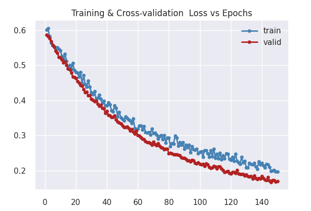
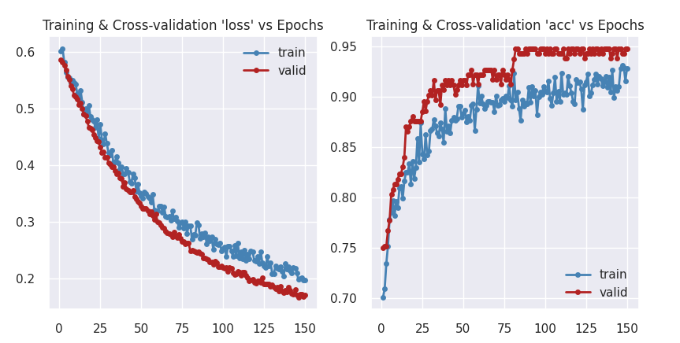

# Pytorch Toolkit - Tutorial (Version 2.0)

Thank you for your interest in the `Pytorch Toolkit`. I wrote this as a set of utility functions & classes that will ease the process of training, evaluating & running predictions from a model. As a developer, I would rather spend my time productively concentrating on the core tasks of ML - viz. preparing data, designing/re-using appropriate model architecture and tuning the hyper-parameters to get the best performance from the model. Keras does a great job of hiding boilerplate code for training the model, evaluating performance and running predictions. I aim to bring the ease that Keras provides to Pytorch via the `Pytorch Toolkit`. 

|**NOTE**|
|:--------|
|<font color="firebrick">This is a complete re-write of the previous single file Pytorch Toolkit. Though that was useful, I quickly realized that I have made several incorrect assumptions, especially regarding metrics, which I have attempted to resolve in this re-architected toolkit. If possible, please move your codebase to this version of the toolkit. This Tutorial will attempt to guide you through all the features of the rewrite.</font>|

I am **releasing this code as-is with no warranties of any kind under the MIT license**. Please feel free to use this in your projects, should you find it useful. Should you use it, please give me a mention :).

I wrote this library much before I discovered `Pytorch Lightning`. If you are looking for a professional maintained library that can help you train your model efficiently on multiple GPUs/TPUs, then Lightning is the way to go. Mine is a very humble attempt to avoid writing boiler-plate code when training Pytorch model.

|**NOTE**|
|:---------------------|
| <font color='firebrick'>This tutorial is **work-in-progress** and is expected to change to some extend, especially if I enhance the `Pytorch Toolkit` with more functions. Do keep checking back for changes - I don't expect the API to change drastically henceforth</font> |

This tutorial will gradually expose you to the API provided by the **Pytorch Toolkit**, so it is best that you **follow
along from beginning to the end**. I use a very informal style of writing, which I hope you'll like. The API is inspired
by Keras, so if you have used Keras before you'll feel very much at home.

I am assuming that you have already installed the pre-requisites and have done the preliminary test as explained in
the [Readme](Readme.md) file - if not, please do so now.

| **A Point To Note**| 
|:-------------------|
| <font color='firebrick'>This is **NOT an ML tutorial** - I don't _teach_ you how to create the best model, training techniques, data loading & preparation techniques etc. This tutorial is _strictly aimed_ at showing you how the `Pytorch Toolkit` can be used to write much lesser code during the phase of training & evaluating model...and nothing more! I cover various scenarios below. So if the model performance is bad, please ignore it! </font> |

With that perspective, let's get started.

## Dependencies

`Pytorch Toolkit` relies on the following Python libraries, which must be installed using `pip` or `conda`. It has been tested on Python 3.8+ on Windows and Linux - I don't own a Mac :(.

* pathlib
* numpy
* pandas
* matplotlib & seaborn
* sklearn
* torch (Pytorch, of course!)
* torchsummary
* torchmetrics

## A note on setting up the library

I have yet to convert this into a PyPl compatible module, which you can `pip` install. Until that is done, please follow the steps below on your local machine to access this library across your Pytorch projects.

1. Clone this repository to your local machine from GitHub under any folder - say `$HOME/code` folder. This could be any folder on your hard disk - let's refer to this folder as the ROOT_FOLDER henceforth.

    ```bash
    $~/code> git clone https://github.com/mjbhobe/dl-pytorch.git
    ```
    This will create a folder `ROOT_FOLDER/dl-pytorch` on your disk.

2. Add the `ROOT_FOLDER/dl-pytorch` to the PYTHONPATH system variable. On Linux, open `.bashrc` and add the following line to it

    ```bashrc
    # replace ~/code in line below with the folder to which 
    # you cloned the dl-pytorch git repo
    export PYTHONPATH=~/code/dl-pytorch
    ```

3. Restart your shell and you are all set.


## Training model when data available in 2D Numpy arrays

For complete code refer to [this code file](pyt_breast_cancer.py)

Often data & labels are available in Numpy arrays. This is true especially for structured datasets (e.g. datasets
available with the `scikit-learn` package, like the Iris dataset, the Boston Housing dataset, the Wisconsin Breast
Cancer dataset etc.) and in several repositories on Kaggle and UCI.

|**Tip**|
|:--------|
| <font color='green'>This scenario will most probably apply to cases when your data is available in a structured columnar format (e.g. a CSV file).</font> |

We'll start with one such example, specifically a _binary classification problem_ on the Wisconsin Breast Cancer
dataset. I'll be downloading the data from
the [UCI Repository link](https://archive.ics.uci.edu/ml/datasets/Breast+Cancer+Wisconsin+(Diagnostic)), but you can
load it from the `scikit-learn datasets` module as well.

### Loading data

This section _does not strictly pertain to the Pytorch Toolkit API_, but I am showing the code nonetheless so you have
some perspective on how our model can be easily trained on data & labels available as Numpy Arrays. Here is the code I
used to load the Wisconsin Breast Cancer dataset - I am not providing detailed instructions here (as it does not pertain
to the Pytorch toolkit)

```python
import pandas as pd
from sklearn.model_selection import train_test_split
from sklearn.preprocessing import StandardScaler

# loading & preparing data
url = 'https://archive.ics.uci.edu/ml/machine-learning-databases/breast-cancer-wisconsin/wdbc.data'

cols = [
    "id","diagnosis","radius_mean","texture_mean","perimeter_mean","area_mean",
    "smoothness_mean","compactness_mean","concavity_mean","concave points_mean",
    "symmetry_mean","fractal_dimension_mean","radius_se","texture_se","perimeter_se",
    "area_se","smoothness_se","compactness_se","concavity_se","concave points_se",
    "symmetry_se","fractal_dimension_se","radius_worst","texture_worst","perimeter_worst",
    "area_worst","smoothness_worst","compactness_worst","concavity_worst",
    "concave points_worst","symmetry_worst","fractal_dimension_worst"
]

df = pd.read_csv(url, header=None, names=cols, index_col=0)
# map 'M' (malignant) to 1 and 'B' (benign) to 0
df['diagnosis'] = df['diagnosis'].map({'M':1, 'B':0})

# grab the data & labels - these will be Numpy arrays!
X = df.drop(['diagnosis'], axis=1).values
y = df['diagnosis'].values
y = y.astype(np.float32)

# split into train/test sets
X_train, X_test, y_train, y_test = \
    train_test_split(X, y, test_size=0.20, random_state=41, stratify=y)

# scale data using Standard scaling
ss = StandardScaler()
X_train = ss.fit_transform(X_train)
X_test = ss.transform(X_test)
# make y a 2D array
y_train = y_train[:, np.newaxis]
y_test = y_test[:, np.newaxis]
```

### Creating our model

Create the model the way you normally do with Pytorch i.e. you'd derive your model from `nn.Module`, create the 'network' in the `__init__()` method and add a `forward()` method. 

```python
import torch
import torch.nn as nn

class WBCNet(nn.Module):
    def __init__(self, inp_size, num_classes):
        super(WBCNet, self).__init__()
        # the sequential network
        self.net = nn.Sequential(
            nn.Linear(inp_size, 16),
            nn.ReLU(),
            nn.Dropout(p=0.10),
            nn.Linear(16, 32),
            nn.ReLU(),
            nn.Dropout(p=0.10),
            nn.Linear(32, num_classes),
            nn.Sigmoid(),
        )

    def forward(self, inp):
        x = self.net(inp)
        return x
```

### Training the Module

Training a module is an intricate process that requires you to choose a `loss function` an the number of `epochs`, the `batch size` and `metrics` you want to track across the epochs as you train the model. You also specify the `device` (CPU or GPU or MPU [if you're on a Mac]) on which to train the model. 

The Pytorch Toolkit provides a `Trainer` class that collects all this information from you. It then _works_ with your `model` and an `optimizer` you provide and manages all the underlying boilerplate code that you would normally write as part of your training, cross-validation and prediction loops.

Following are the steps you need to follow:

#### Step 1 - instantiate the `Trainer` class instance

Here is the constructor for the `Trainer` class:
```python
import pytorch_training_toolkit as t3

trainer = t3.Trainer(
  loss_fn,          # any of the Pytorch provided loss functions
  device,           # the device to use for training (CPU, GPU, MPU)
  metrics_map=None, # additional metrics you want to track
  epochs = 25,      # no of epochs you want to train for (default = 25)
  batch_size = 64,  # batch size you want to use (default = 64)
)
```

For the breast cancer classification problem:
* This is a binary classificaction problem, so we'll use the `nn.BCELoss()` function as the loss function (`loss_fn`)
* This is the standard code used at the top of the file to determine the device to train the model on - this is pretty standard.
  ```python
  DEVICE = (
      "cuda"
      if torch.cuda.is_available()
      else "mps" if torch.backends.mps.is_available() else "cpu"
  )
  ```
* Let's train for 150 epochs with a batch size of 16
* To begin with let's not track any additional metrics (let's forget the `metrics_map` parameter for just this once)

So here is how we'll instantiate the `Trainer` class in our case.

```python
import torch
import torch.nn as nn
import pytorch_training_toolkit as t3

DEVICE = (
    "cuda"
    if torch.cuda.is_available()
    else "mps" if torch.backends.mps.is_available() 
    else "cpu"
)

trainer = t3.Trainer(
  loss_fn = nn.BCELoss(),
  device = DEVICE,
  epochs = 150,      
  batch_size = 16
)
```

#### Step 2 - choose an optimizer & train the model

We can choose any of the optimizers provided by Pytorch - in our case, let's use the `SGD` optimizer.

```python
optimizer = torch.optim.SGD(
  model.parameters(), 
  lr=0.001, 
  weight_decay=0.01
)
```

#### Step 3 - train the model!

Here is the code to train the model - we'll need an instance of our model, of course, the dataset(s) to train on, an optimizer. Then we call the `fit()` method of our `Trainer` class we instantiated above and it will do all the good stuff under the hood for us - like calling the training & cross-validation steps, placing the model & data on correct device, measuring metrics(if any) and tracking metrics etc.

Here is the code:
```python
NUM_FEATURES = 30   # we have 30 features in dataset
NUM_CLASSES = 1     # binary classification

model = WBCNet(NUM_FEATURES, NUM_CLASSES)

optimizer = torch.optim.SGD(
  model.parameters(), 
  lr=0.001, 
  weight_decay=0.01,
)

hist = trainer.fit(
  model,
  optimizer,
  train_dataset=(X_train, y_train),
  validation_split=0.2,
)
```

Since we do not have a _decicated_ cross-validation dataset, we ask the trainer to internally randomly split the training dataset `(X_train, y_train)`, setting aside 20% of the training dataset as the cross-validation dataset - by specifying `validation_split=0.2`. 

If we had a _dedicated_ cross-validation dataset instead (for example `(X_val, y_val)`), we can use it with the `val_dataset` parameter of the `fit()` method above as follows:

```python
hist = trainer.fit(
  model,
  optimizer,
  train_dataset=(X_train, y_train),
  val_dataset=(X_val, y_val),
)
```

The above call will output something like the following (your values may be slightly different than the ones below):

```
Epoch (  1/150): (364/364) -> loss: 0.6014 - val_loss: 0.5864
Epoch (  2/150): (364/364) -> loss: 0.6060 - val_loss: 0.5829
Epoch (  3/150): (364/364) -> loss: 0.5824 - val_loss: 0.5764

...
... many more rows
...

Epoch (148/150): (364/364) -> loss: 0.2020 - val_loss: 0.1724
Epoch (149/150): (364/364) -> loss: 0.1974 - val_loss: 0.1679
Epoch (150/150): (364/364) -> loss: 0.1977 - val_loss: 0.1703
```

The `fit()` method above returns an instance of a `MetricsHistory` object, which tracks metric(s) across the various epochs as the model trains. The `loss` metric is **always** tracked along with any additional metrics you specifiy when constructing the `Trainer` object. Before we see how that can be done, let's see how the `loss` metric performed across all the epochs. To view a plot, all you have to do is to call the following function

```python
# fig_size determines size of plot and is an optional parameter
hist.plot_metrics(fig_size=(16, 8))
```

And you will see something like this - convenient ha? 



Since we had a validation dataset (specified indirectly via the `validation_split` parameter), we get 2 plots - one for the `train` loss and one for the `cross-validation` loss. We'll see in a short while how this plot changes if you specify additional metrics to track during training.

As a best practice, I always save my model's weights after the trainingf loop completes and delete instance of the model as follows:

```python
# call the save_model function from pytorch_training_toolkit
# MODEL_SAVE_PATH is any valid path where model is to be saved
MODEL_SAVE_PATH = "./model_states/wisconsin_breast_cancer.pth"
t3.save_model(model, MODEL_SAVE_PATH)
del model
```

And that completes the training step!

#### Step 4 - evaluate the model performance

Here is how you can evaluate model's performance on any dataset. During the evaluation phase the `Trainer` class internally sets `model.eval()` and runs through the dataset and calculates all the metrics you specified when you instantiated the `Trainer` instance. We use the `Trainer` classe's `evaluate()` method as follows:

```python
# since we deleted the model after training, we instantiate it again
model = WBCNet(NUM_FEATURES, NUM_CLASSES)
# and load model state from state file
model = t3.load_model(model, MODEL_SAVE_PATH)

# evaluate performance on test set as follows
metrics = trainer.evaluate(model, dataset=(X_test, y_test))
print(f"Testing metrics -> {metrics}")
```

Since we did not specify any additonal metrics, we see the following output - the trainer will make 1 pass (1 epoch) across the dataset and update metric at end of each batch. At the end of the epoch, it will display average value of all metric(s)

```shell
Evaluating (114/114) -> loss: 0.2269
Testing metrics -> {'loss': 0.22685137670487165}
```

#### Step 5 - making predictions

To run predictions on a dataset, you can call the `Trainer` class' `predict()` method. This method returns a tuple of 2 Numpy arrays - the first member are the predictions and the 2nd the corresponding actual values of the data.

Here is the code:

```python
preds, actuals = trainer.predict(model, dataset=(X_test, y_test))
preds = np.round(preds).ravel()
actuals = actuals.ravel()

# now use preds & actuals (both Numpy arrays) as you like

# here we print incorrect classification counts
print(f"Incorrect prediction counts: {(preds != actuals).sum()} of {len(actuals)}")
```

### Tracking additional metrics when training

You can track any number of metrics during the training loop - for example we could track `accuracy` across the epochs. Which metrics you use depend on the training task at hand. Pytorch Training Toolkit relies on the `torchmetrics` library for all metrics - you will find most of the metrics you are likely to use in this library. But in the very unlikely case that you do not, you can always write a custom metric function for the same - we'll cover that a bit later.

Let's start by adding an `accuracy` metric. Since this is a binary classification class, the `torchmetrics.classification.BinaryAccuracy` seems most appropriate to use. Recall the `metrics_map` parameter of the `Trainer` class? Here is how we use it to track more metrics.

```python
from torchmetrics.classification import BinaryAccuracy
# additional metrics are specified as a dictionary like this
metrics = {
  # the 'key' of the dict item is any string you like - I have used "acc"
  # the value points to the function that caluculates the metric - in
  # this case it will be BinaryAccuracy()
  "acc" : BinaryAccuracy(),
}
```

The only change you need to make to all of the code we covered above is in the `Trainer` class' constructor. Here is the modified code:

```python
trainer = t3.Trainer(
  loss_fn = nn.BCELoss(),
  device = DEVICE,
  epochs = 150,      
  batch_size = 16,
  # this is the new line to add to constructor
  metrics_map = metrics,
)
```

The rest of the code does not change! 

#### Training the model with additional metric(s)

* To train the model, you'll make the same call as below:
```python
# call fit() as before
hist = trainer.fit(
  model, 
  optimizer, 
  train_dataset=(X_train,y_train),
  validation_split=0.2,
)
```

Since we are tracking additional metrics, the metrics pops up in the output as below:

```
Epoch (  1/150): (364/364) -> loss: 0.6014 - acc: 0.7011 - val_loss: 0.5864 - val_acc: 0.7500
Epoch (  2/150): (364/364) -> loss: 0.6060 - acc: 0.7092 - val_loss: 0.5829 - val_acc: 0.7519
Epoch (  3/150): (364/364) -> loss: 0.5824 - acc: 0.7346 - val_loss: 0.5764 - val_acc: 0.7519

...
... many more lines
...

Epoch (148/150): (364/364) -> loss: 0.2020 - acc: 0.9293 - val_loss: 0.1724 - val_acc: 0.9432
Epoch (149/150): (364/364) -> loss: 0.1974 - acc: 0.9158 - val_loss: 0.1679 - val_acc: 0.9479
Epoch (150/150): (364/364) -> loss: 0.1977 - acc: 0.9284 - val_loss: 0.1703 - val_acc: 0.9479
```

Notice that metric is labeled `acc` - the same value we used in the metrics map - on the training set and `val_acc` on the cross-validation set (somewhat like Keras does)

The `fit()` method returns a `MetricsHistory` object as before. If we plot the metrics, we'll see s different plot as shown below. Notice that we also see plot of the `acc` metric we specified.



#### Evaluating model performance with additional metric(s)

You'll use exactly the same code to evaluate model performance - you'll see the additional metric pop up in the output, of course.

```python
model = WBCNet(NUM_FEATURES, NUM_CLASSES)
# and load model state from state file
model = t3.load_model(model, MODEL_SAVE_PATH)

# evaluate performance on test set as follows
metrics = trainer.evaluate(model, dataset=(X_test, y_test))
print(f"Testing metrics -> {metrics}")
```

```bash
Evaluating (114/114) -> loss: 0.2269 - acc: 0.9375
Testing metrics -> {'loss': 0.22685137670487165, 'acc': 0.9375}
```

This tells me that I get an accuracy if 93.75% on the test set - not bad!

#### Making predictions 

Since making predictions has nothing to do with number of metrics tracked during training, it's reasonable to assume that the code & outputs will be exactly the same as before. In fact, here's the same code again:

```python
preds, actuals = trainer.predict(model, dataset=(X_test, y_test))
preds = np.round(preds).ravel()
actuals = actuals.ravel()

# now use preds & actuals (both Numpy arrays) as you like

# here we print incorrect classification counts
print(f"Incorrect prediction counts: {(preds != actuals).sum()} of {len(actuals)}")
```

And we get

```
We got 8 of 114 predictions wrong!
```

### Adding your own metrics

To define a custom metric, all you have to do is to provide a function that expects 2 tensors as below - the shape of the tensors will depend on the architecture of your Pytorch model.

```python
def my_metric(preds:tensor, target:tensor) -> float:
  # your code to calculate the metric
  metric = {code to calculate metric from preds & target}
  return metric.item()

# and you can add this to the metrics_map as below
metrics = {
  "acc": BinaryAccuracy(),
  "mymet": my_metric,
}

trainer = Trainer(
  # ... other params
  metrics_map = metrics
)

# rest of code is same
hist = trainer.fit(...)
```

You can track any number of metrics when training your model, depending on your needs and the problem at hand. Just add the metrics to the `metrics` map above assigning each an appropriate `name` and the `Trainer` will track the metric across epochs.

### The `trainer.fit()` function

The `fit()` function of the `Trainer` class is defined as follows:

```python
def fit(
    self,
    model: nn.Module,
    optimizer: torch.optim.Optimizer,
    train_dataset: Union[
        NumpyArrayTuple, torch.utils.data.Dataset, torch.utils.data.DataLoader
    ],
    validation_dataset: Union[
        NumpyArrayTuple, torch.utils.data.Dataset, torch.utils.data.DataLoader
    ] = None,
    validation_split: float = 0.0,
    l1_reg: float = None,
    lr_scheduler: Union[LRSchedulerType, ReduceLROnPlateauType] = None,
    early_stopping: EarlyStopping = None,
    reporting_interval: int = 1,
    verbose: bool = True,
    logger: logging.Logger = None,
    shuffle: bool = True,
    num_workers: int = 4,
    seed=41,
) -> MetricsHistory:
```

This give you a lot of flexibility to train the Pytorch module and also to incorporate additional functionality during training.
* `model` (required, type: nn.Module) - the model to be trained.
* `optimizer` (required, type: torch.optim.Optimizer) - optimizer to use during training. Use any one of the Pytorch provided optimizers.
* `train_dataset` (required, type: multiple datatypes) - this can morph into a parameter that takes a tuple of 2 Numpy arrays (as we have shown above) OR a `torch.utils.data.Dataset` OR a `torch.utils.data.DataLoader` object. Depending on how you prepare your data, you can use any of these objects.
* `validation_dataset` (optional, type: multiple datatypes, default=None) - use this parameter to pass in a dedicated cross-validation dataset, if available. Just like the `train_dataset`, this parameter takes similar paramater types as that of `train_dataset`.<br/>
Don't mix data-types for the `train_dataset` and `validation_dataset` parameters. That is, if type of `train_dataset` is a `torch.utils.data.Dataset` type, then `validation_dataset` should also be a `torch.utils.data.Dataset` type.
* `validation_split` (optional, float, default=0.2) - we have used this parameter in the examples above, so we won't explain it again. It takes a value between 0.0 and 1.0.<br/>
Use either `validation_dataset` or the `validation_split` parameter but not both. Should you specify both the `fit()` function will use `validation_dataset` and ignore the `validation_split` parameter.
* `l1_reg` (optional, float, default=None) - The amount of L1 regularization to be applied to the weights of the model during back-propogation.
* `lr_scheduler` (optional, default=None) - learning rate scheduler to be applied during training. Use either an ReduceLROnPlateau instance or any one of the LR schedulers defined by Pytorch (StepLR, ExponentialLR etc.)
* `early_stopping` (optional, type: torch_training_toolkit.EarlyStopping type, default=None) - Use to early stop training (before all epochs are done) if one of the metrics tracked is not improving for a set of X epochs. This should be an instance of EarlyStopping class defined as part of this toolkit.
* `reporting_interval` (optional, type: int, default=1) - The interval (i.e. number of epochs) after which progress will be reported when training.<br/>
By default, training progress is reported/printed after each epoch. Set this value to change the interval for example, if reporting_interval = 5, progress will be reported on the first, then every fifth epoch thereafter, and the last epoch (example: if epochs=22, and reporting_interval=5, then progress will be reported on 1, 5, 10, 15, 20 and 22 epoch).
* `verbose` (optional, type: bool, default=True) - Specify if the training progress across training data is to be reported at end of each batch (True) or end of epoch (False).
* `logger` (optional, type: logging.Logger, default=None) - An instance of the logging.Logger class to be used to log progress as the model trains.<br/>
**NOTE:** the torch training tooklit provides a `get_logger()` function with some default console & file logging configurations, which you can use, if needed.
* `shuffle` (optional, type bool, default=True) - to specify if the training (and validation data, if specified) should be shuffled before each epoch (True) or not (False). It is a good practice to shuffle the datasets, unless you are working with time-series datasets (or any other datasets) where data must be fed to the `nn.Module` in the sequence in which it is read.
* `num_workers` (optional, type: int, default=4) - The numbers of workers to be used when shuffling the train & cross-validation datasets.

You can address several issues during training by using various combination of these parameters. We have developed a series of multi-class classification examples on the Fashion MNIST dataset. Please refer to examples as below:
* [pyt_fashion_mnist_dnn.py](pyt_fashion_mnist_dnn.py) - basic multi-class classification examples without using additional metrics. We have separate instances of training & cross-validation datasets and data is available as instances of `torch.utils.data.Dataset` class.
* [pyt_fashion_mnist_dnn2.py](pyt_fashion_mnist_dnn2.py) - add additional metrics `acc` and `f1` which are tracked during training.
* [pyt_fashion_mnist_dnn3.py](pyt_fashion_mnist_dnn3.py) - adds a learning rate scheduler to the training loop. We use the `StepLR` learning rate scheduler.
* [pyt_fashion_mnist_dnn4.py](pyt_fashion_mnist_dnn4.py) - adds early stopping to training loop.

### The `TrainingArgsParser` utility class
Across the examples above, you'll notice that we have used a utility `TrainingArgsParser` class. This class is derived from the `argparse.ArgumentParser` class and provides several convenient command line parameters, with default values for each parameter, that helps you set values for various hyper-parameters you used during the training/evaluation and testing process.

For example, this class allows you to set values for `epochs`, `batch_size`, whether to selectively run just the training (`train`) or evaluation (`eval`) or testing (`test`) and so on.

Here is how you can use the class:

```python
import torch_training_toolkit as t3

if __name__ == "__main__":
  parser = t3.TrainingArgsParser()
  args = parser.parse_args()

  # now you can use all the parameters configured
  # in the TrainingArgsParser class, like this
  if args.train:
    # execute the training part 

  if args.eval:
    # execute the evaluation

  if args.test:
    # execute the test
```

When calling the Python file on the command line you will use parameters as follows:

```bash
$> python fashion_dnn.py --train --eval --test --epochs=45 --batch_size=45 ....
```

Here are the parameters defined in the `TrainingArgsParser` class, with their default values:
* `--train` (bool, default False) - pass this flag to train model
* `--eval`  (bool, default False) - pass this flag to cross-validate model
NOTE: you must have a cross-validation dataset defined
* `--pred` (bool, default False) - pass this flag to run predictions against a test dataset.  
NOTE: you must have a test dataset defined & you must have trained model before
* `--show_sample` (bool, default False) - pass this parameter to signal that your code should display a sample of loaded data.
* `--epochs=EPOCHS` (int, default 25) - use this flag to define the number of training epochs
* `--batch_size=BATCH_SIZE` (int, default 64) - use this flag to define batch size
* `--lr=LR` (float, default 0.001) - use this flag to define the learning rate
* `--l2_reg=L2_REG` (float, default 0.005) - use this flag to define quantum of L2 regularization applied by the optimizer (i.e. the weight=XXX parameter of the optimizer)
* `--verbose=level` (int, default 2) - define the verbosity of the output from training loop
    0 = silent (no progress reported),
    1 = update at end of epoch only,
    2 = detailed batch-by-batch progress reported
* `--val_split` (float, default=0.20) - define the validation split percentage (default 20%)
* `--test_split` (float, default=0.10) -- define the test split percentage (default 10%)